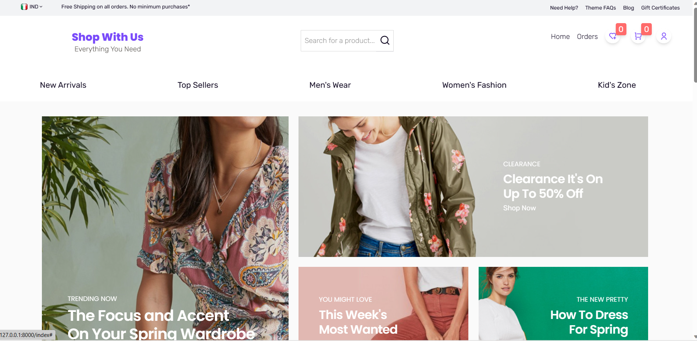
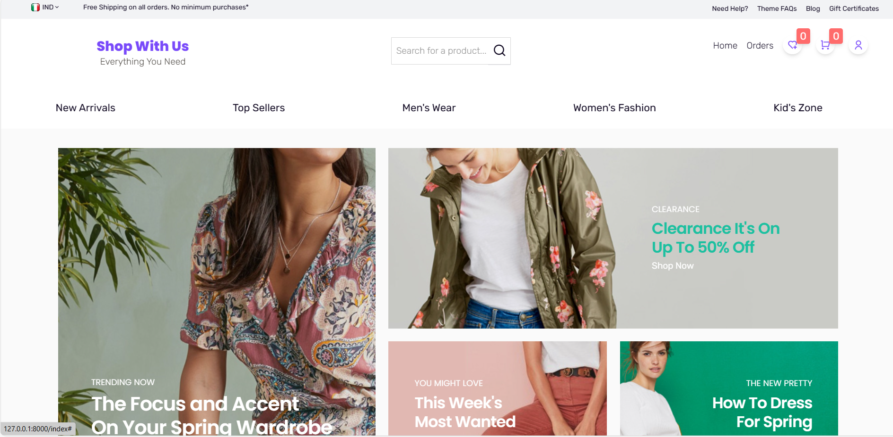

<h2>Single Vendor Ecommerce Application </h2>

  

  

  

This is a single-vendor eCommerce application built using Laravel . The application provides a platform for a single seller to showcase and sell products to customers. It follows a modern, scalable architecture to deliver a seamless shopping experience.The front end is rich with classy CSS and JS features.

## Features

- **Product Management:**
  - Add, edit, and delete products with details like name, description, pricing, and images.
  - Categorize products for easy navigation.

- **Shopping Cart:**
  - Users can add products to their cart and proceed to checkout.

- **Order Processing:**
  - Seamless order processing with features like order confirmation and email notifications.

- **User Authentication:**
  - Secure user registration and login functionality.

- **Responsive Design:**
  - Mobile-friendly design for a great user experience on various devices.

- **Admin Dashboard:**
  - Provide an admin dashboard for managing orders, products, and customer accounts.

## Technologies Used

- **Backend:**
  - Laravel (PHP)
  - Eloquent ORM for database interactions
  - Authentication and Authorization features

- **Frontend:**
  - JavaScript 
  - HTML/Tailwind CSS
  - Responsive design using Tailwind CSS

- **Database:**
  - MySQL 
